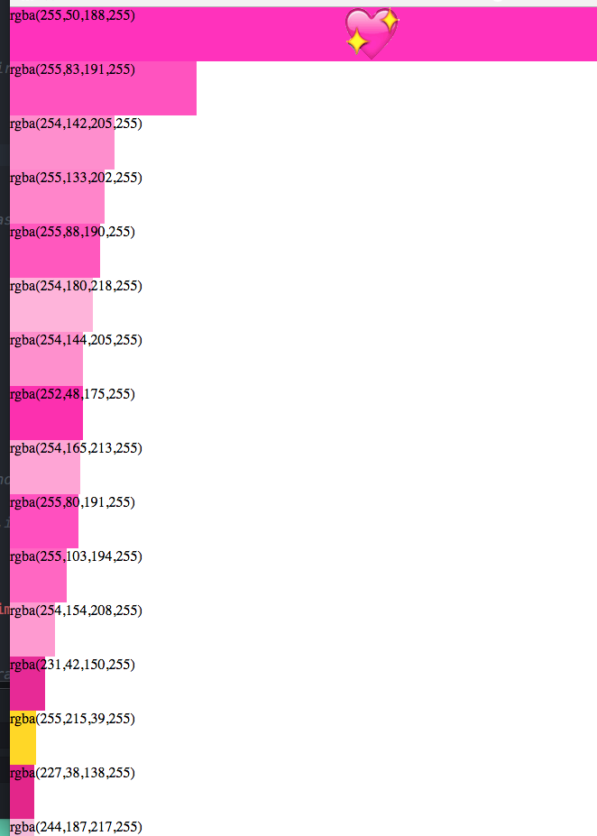
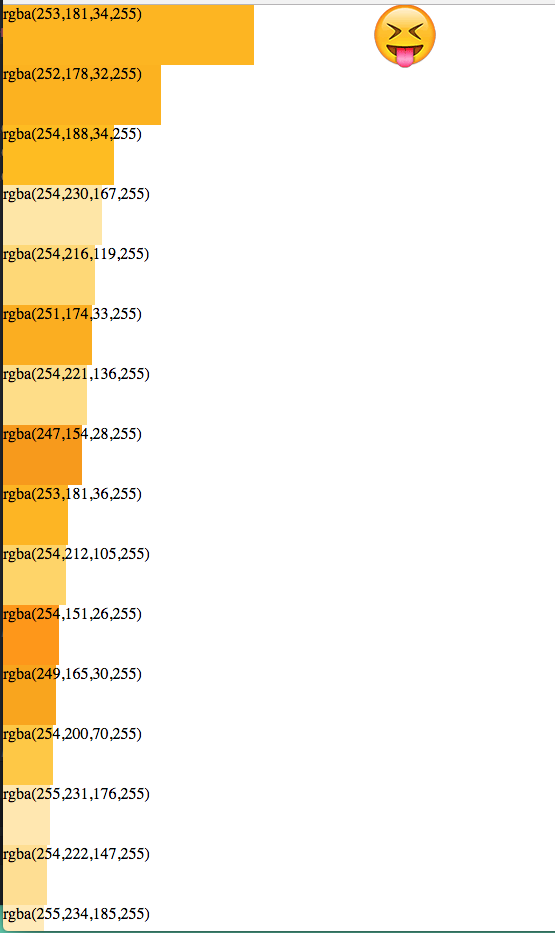
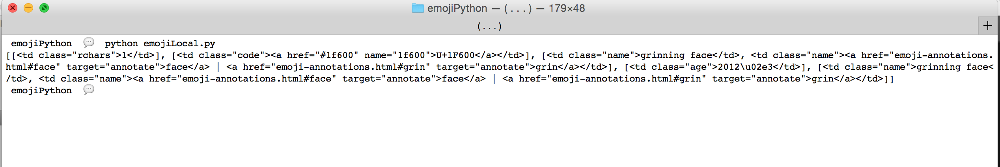

# emojiPalette

## about

project by [aarón montoya-moraga](https://github.com/aamontoya89), [eve weinberg](https://github.com/evejweinberg),[rebecca (marks) leopold](https://github.com/rebleo), [xiwei huang](https://github.com/xiweiihuang).

## to do

* scrape scrape emoji data from [unicode](http://www.unicode.org/emoji/charts/full-emoji-list.html)
* figure out how to strip and organize data
* figure out how to access links embedded in data table
* decide if save to local or create server
* figure out how to build and api for general use
* run all the emojis through  pixel-code and organize the data set accordingly.

DATA VISUALIZE the whole thing in so many ways.
shiffman had great insight about
looking for biases and representing our findings visually.
I see color wheels, rainbows, categories, people of/and their colors, this PROOF OF CONCEPT stage is wide for awesome projects/scripts - anything we can think of.

## further steps:
Draw to canvas? Do we want to figure out how to do this ourselves or build on  ?
FUNCTION time, this is a time where we create the "tools" the palette, the thing we want to then, SHARE
xo // 💚

		-

## resources

* [ascii art](https://en.wikipedia.org/wiki/ASCII_art)
* [unicode](http://www.unicode.org)
* [meaining of emoji](http://a16z.com/2016/08/02/emoji/)
* [emoji](https://en.wikipedia.org/wiki/Emoji)
* [p5.js libraries](http://p5js.org/libraries/)
* [js-emoji](https://github.com/iamcal/js-emoji)
